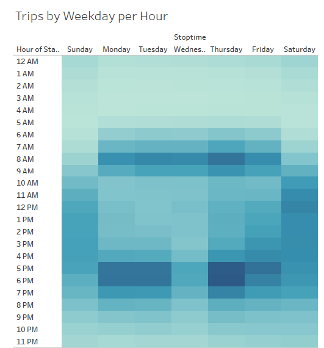
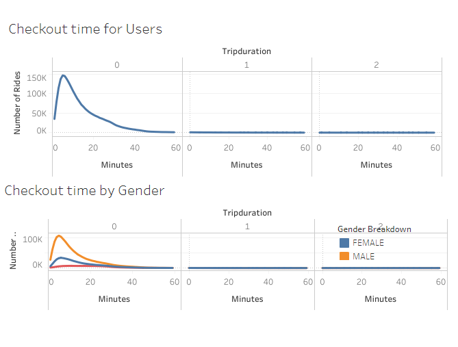
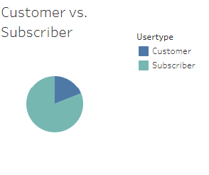

# CitiBike Sharing
[link to dashboard](https://public.tableau.com/views/CitibikeSharing/Story2?:language=en-US&:display_count=n&:origin=viz_share_link)

The purpose of this analysis is to assist in bringing CitiBike to Des Moines. 

When taking a look at the Trips by weekday per hour chart, you will notice a lot of users will ride during the hours of 5pm-7pm. This could potentially be for after work or school use. 

The total checkout time per ride is farily short. Equally more important though, is to note exactly how many rides those are. There are a total of 145,752 rides with a total of a 6 minute ride time.

Another good point I would like to note is how many riders are actually subscribed to the service. There are close to 2 million subscribers as opposed to just customers where there are only about 443,000. With such a high subscribtion rate, you could guess that these are regular daily riders. 